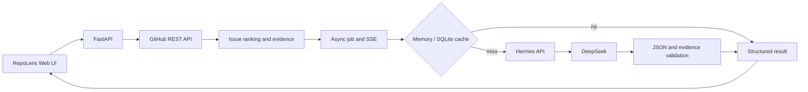

# RepoLens

> 一个可验证、成本可观测的 GitHub Issue 分析实验项目。
> An evidence-grounded and cost-observable GitHub Issue analysis experiment.

RepoLens 使用透明规则完成公开仓库概览、Issue 排序和候选文件检索，再通过本机 Hermes 调用 DeepSeek，为 Issue 生成带代码证据的结构化分析。

## Project Conclusion

最初假设是：开发者需要一个独立页面，帮助他们理解陌生仓库并为 GitHub Issue 生成修改建议。

真实使用后发现，这个产品假设不够强：想直接解决问题的用户可以把任务交给 Hermes、Claude Code、Codex 等 Coding Agent；只想获得分析的用户也可以直接询问 DeepSeek。独立的 Issue 分析页面位于两者之间，没有形成足够明显的用户优势。

RepoLens 因此在 v0.5 完成工程化收尾后停止扩展注册、多租户和自动改代码等产品功能，并保留为一个可复现的 AI 应用工程案例。它记录了如何把一次可能产生 18 次模型调用、17 次工具调用且输出不稳定的 Agent 任务，改造成有代码证据、预算边界、持久缓存、失败降级和评测数据的受控流程。

- [完整项目复盘：最初假设、真实失败、工程优化与停止扩展原因](docs/project-retrospective.md)
- [系统架构、信任边界与失败矩阵](docs/architecture.md)
- [简历写法、30 秒介绍与面试问答](docs/interview-guide.md)
- [v0.5 评测报告](docs/evaluation-v0.5.md)

## Current Status

- Open WebUI runs locally at `http://127.0.0.1:3000`.
- Hermes Agent exposes an OpenAI-compatible API at `http://127.0.0.1:8642/v1`.
- Hermes uses the existing DeepSeek provider configuration.
- The RepoLens dashboard runs at `http://127.0.0.1:8000`.
- The working dashboard analyzes a public GitHub repository, its languages, root directory, and open issues.
- Issue ranking and candidate files continue to use transparent heuristics rather than LLM guesses.
- For each displayed Issue, RepoLens calls DeepSeek through the local Hermes gateway to generate a Chinese explanation, implementation steps, test plan, and risk notes.
- Repository metadata and Issue rankings render first. Only the highest-ranked Issue is analyzed automatically; all remaining Issues call AI only when expanded. Users can switch to fully on-demand mode for the lowest cost.
- Successful AI results are cached in SQLite by repository, Issue number, GitHub update timestamp, and Prompt version (up to 256 entries), with an in-memory hot layer.
- If Hermes is unavailable or returns invalid structured output, the repository analysis still succeeds with clearly marked rule-based fallback guidance.
- Issue guidance uses Hermes as a tool-free text inference request (`tool_choice: none`, no tools, low reasoning, 700-token output limit). A v0.5 real-Issue check on 2026-07-20 completed in 26.03 seconds with 19,711 provider-reported tokens and an estimated ¥0.021249 cost; an immediate persistent-cache repeat took 0.057 seconds with no new model charge.
- Candidate source files are fetched read-only from GitHub, reduced to bounded line-numbered snippets, and exposed as evidence IDs. Issue analysis runs as a background job with SSE progress events.
- When Hermes forwards token usage, the UI shows input, output, total tokens, cache breakdown, and an estimated CNY cost.

## Local Services

The current Windows launcher expects the project Python environment at `.conda`, Hermes Agent and its `config.yaml` under `E:\hermes_root\hermes`, and an existing DeepSeek provider configured in Hermes. Node.js is only needed for the optional frontend syntax check.

The launcher reads the Hermes gateway key from the external Hermes configuration and passes it to child processes without copying it into tracked project files. Start all local services with:

```powershell
powershell -ExecutionPolicy Bypass -File .\scripts\start-repolens.ps1
```

Use `-NoBrowser` when a browser window is not wanted. Stop services launched by the script with:

```powershell
powershell -ExecutionPolicy Bypass -File .\scripts\stop-repolens.ps1
```

Runtime logs and PID metadata are written to `.runtime/` and are ignored by Git.

For a reproducible backend container, copy `.env.example` to `.env`, set `HERMES_API_KEY`, ensure the host Hermes gateway is running, then use:

```powershell
docker compose up --build
```

The Compose service persists SQLite data in the `repolens-data` volume and reaches the host Hermes gateway through `host.docker.internal`.

## Usage

Open `http://127.0.0.1:8000`, enter a public repository URL, and select **Analyze repository**. Authentication is optional for early local testing. Set `GITHUB_TOKEN` in the process environment later if the anonymous GitHub API rate limit becomes restrictive.

Repository metadata and ranked Issues appear before AI guidance. Only the highest-ranked Issue is prefetched by default; expand another Issue to request its analysis, or choose fully on-demand mode. Hermes configuration uses `HERMES_API_BASE` (default `http://127.0.0.1:8642/v1`), `HERMES_MODEL` (default `hermes-agent`), and `HERMES_API_KEY` (required for AI analysis).

## API Behavior

- `POST /api/v1/repositories/analyze` validates a public GitHub URL and returns repository metadata, languages, root entries, ranked Issues, candidate files, and rule-based implementation steps.
- `POST /api/v1/issues/analyze` remains as a synchronous compatibility endpoint.
- `POST /api/v1/issues/analyze/jobs` starts or reuses a background analysis; its status and SSE stream are available below `/api/v1/issues/analyze/jobs/{id}`.
- Successful Hermes results are cached persistently. Fallback results are not cached, and concurrent requests for the same cache key share one active computation.
- Cache capacity is 256 entries with least-recently-used eviction. A Prompt-version component prevents incompatible old output from being reused.
- Hermes requests are limited to three concurrent calls and time out after 60 seconds.

## Token Cost and Savings

`max_tokens=700` limits generated output; it is not the amount billed. Actual billing uses input and output tokens returned in the provider `usage` object. RepoLens applies this estimate:

```text
cost CNY = cache-hit input / 1,000,000 × hit price
         + cache-miss input / 1,000,000 × miss price
         + output / 1,000,000 × output price
```

The default rates in `.env.example` follow the linked `deepseek-v4-flash` CNY pricing visible on 2026-07-20. Pricing and the model behind Hermes can change, so `DEEPSEEK_PRICING_MODEL` and all three rate variables must match the actual account configuration. See the [official DeepSeek pricing page](https://api-docs.deepseek.com/zh-cn/quick_start/pricing).

RepoLens reduces paid usage by defaulting to on-demand analysis, persisting successful results, merging duplicate in-flight requests, limiting Issue bodies to 3,500 characters, limiting evidence to three files and 4,500 characters, disabling tool loops, using low reasoning, and capping output at 700 tokens. A cache hit does not issue a new DeepSeek request.

## Architecture



See [the architecture document](docs/architecture.md) for the request sequence, cache key, trust boundaries, and failure matrix.

## Verification

Run the backend suite from the repository root:

```powershell
.\.conda\python.exe -m unittest discover -s backend/tests -v
```

The v0.5 suite contains 34 tests covering URL validation, ranking heuristics, evidence extraction, path traversal rejection, persistent caching, LRU eviction, token-cost calculation, the one-auto-Issue budget policy, asynchronous jobs, SSE, fallback behavior, malformed Hermes responses, timeouts, prompt-injection isolation, request concurrency, and the repository-to-Issue API workflow.

Python syntax can be checked without writing bytecode, and the frontend's inline script can be compiled by Node.js. The v0.4 closeout also requires `git diff --check` and `git status` review.

The fixed heuristic evaluation currently contains five cases and reports 100% Top-1 accuracy and 100% Top-3 recall. This is a small regression set, not a general accuracy claim; methodology and limitations are recorded in `docs/evaluation-v0.5.md`.

## Known Limitations

- AI latency depends on the local Hermes queue and configured DeepSeek model; the measured request still took about 30 seconds.
- Background jobs are process-local; restarting the backend loses active job state, but completed SQLite-cached analysis remains available.
- Candidate files still use path and Issue-keyword heuristics. Evidence snippets improve verifiability but do not provide full semantic repository understanding.
- Only public `github.com` repositories are supported; private repositories and GitHub Enterprise are not supported.
- The launcher contains machine-specific Windows paths and is not yet a portable installer.
- The current evaluation corpus is too small for a production-quality accuracy claim, and live model quality is not evaluated in CI.

## Project Status

1. v0.3: public repository analysis, Issue ranking, and candidate files. **Complete**
2. v0.4: structured Hermes guidance, tool disabling, safe fallback, and bounded caching. **Complete**
3. v0.5: line-level evidence, token/cost telemetry, persistent caching, background jobs, SSE, CI, fixed regression cases, and Docker deployment. **Complete**
4. Current: maintenance state. Registration, multi-tenancy, private-repository support, and autonomous code editing are intentionally not planned because the independent Issue-analysis product hypothesis was not validated.

## Security

Secrets remain in the existing Hermes configuration and are never copied into this repository. `.webui_secret_key`, `.env` files, key material, local databases, caches, and runtime logs are ignored and must never be committed. Model output and GitHub content are treated as untrusted input; Issue text is placed only in the user message, tools are disabled, and failure logs exclude API keys and full Issue bodies.
