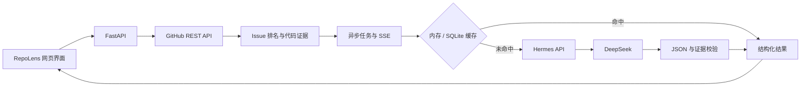

# RepoLens

> 一个可验证、成本可观测的 GitHub Issue 分析实验项目。
> 用真实代码证据约束模型输出，用可复现数据记录性能、成本与失败边界。

RepoLens 使用透明规则完成公开仓库概览、Issue 排序和候选文件检索，再通过本机 Hermes 调用 DeepSeek，为 Issue 生成带代码证据的结构化分析。

## 项目结论

最初假设是：开发者需要一个独立页面，帮助他们理解陌生仓库并为 GitHub Issue 生成修改建议。

真实使用后发现，这个产品假设不够强：想直接解决问题的用户可以把任务交给 Hermes、Claude Code、Codex 等 Coding Agent；只想获得分析的用户也可以直接询问 DeepSeek。独立的 Issue 分析页面位于两者之间，没有形成足够明显的用户优势。

RepoLens 因此在 v0.5 完成工程化收尾后停止扩展注册、多租户和自动改代码等产品功能，并保留为一个可复现的 AI 应用工程案例。它记录了如何把一次可能产生 18 次模型调用、17 次工具调用且输出不稳定的 Agent 任务，改造成有代码证据、预算边界、持久缓存、失败降级和评测数据的受控流程。

- [完整项目复盘：最初假设、真实失败、工程优化与停止扩展原因](docs/project-retrospective.md)
- [系统架构、信任边界与失败矩阵](docs/architecture.md)
- [简历写法、30 秒介绍与面试问答](docs/interview-guide.md)
- [v0.5 评测报告](docs/evaluation-v0.5.md)

## 当前功能

- Open WebUI 本地地址为 `http://127.0.0.1:3000`。
- Hermes Agent 在 `http://127.0.0.1:8642/v1` 提供兼容 OpenAI 的接口，并复用已有 DeepSeek Provider 配置。
- RepoLens 控制台运行在 `http://127.0.0.1:8000`。
- 控制台可以分析公开 GitHub 仓库的基本信息、语言、根目录和开放 Issue。
- Issue 排名和候选文件使用透明启发式规则，不由大模型凭空猜测。
- RepoLens 通过本机 Hermes 网关调用 DeepSeek，为 Issue 生成中文问题解释、实施步骤、测试方案和风险提示。
- 仓库元数据与 Issue 排名优先展示；默认只自动分析排名最高的一条，其余 Issue 展开时才调用 AI，也可切换为全部按需模式。
- 成功结果按照仓库、Issue 编号、GitHub 更新时间和 Prompt 版本写入 SQLite，最多保留 256 条，并使用内存热缓存加速读取。
- Hermes 不可用或返回无效结构时，仓库基础分析仍能成功，并明确显示规则降级结果。
- Issue 分析使用禁用工具的纯文本推理请求：`tool_choice: none`、`tools: []`、低推理强度、700 Token 输出限制。
- 2026-07-20 的 v0.5 真实 Issue 验证耗时 26.03 秒，Provider 报告总计 19,711 Token，按当时配置估算为 ¥0.021249；相同请求通过持久缓存再次读取只需 0.057 秒，没有新增模型费用。
- 候选源码以只读方式从 GitHub 获取，裁剪成有长度边界且带行号的片段，并分配证据 ID。
- Issue 分析在后台执行，前端通过 SSE 展示进度。
- Hermes 返回 Token 用量后，界面会显示输入、输出、缓存命中、总 Token 和人民币成本估算。

## 本地服务

Windows 启动脚本默认要求项目 Python 环境位于 `.conda`，Hermes Agent 及其 `config.yaml` 位于 `E:\hermes_root\hermes`，并且 Hermes 中已经配置可用的 DeepSeek Provider。Node.js 只用于可选的前端语法检查。

启动脚本从外部 Hermes 配置读取网关密钥，并通过子进程环境传递，不会把密钥复制到受 Git 管理的项目文件中。启动全部本地服务：

```powershell
powershell -ExecutionPolicy Bypass -File .\scripts\start-repolens.ps1
```

不希望自动打开浏览器时使用 `-NoBrowser`。停止脚本启动的服务：

```powershell
powershell -ExecutionPolicy Bypass -File .\scripts\stop-repolens.ps1
```

运行日志和 PID 元数据写入 `.runtime/`，该目录已被 Git 忽略。

需要通过容器复现后端时，将 `.env.example` 复制为 `.env`，设置 `HERMES_API_KEY`，确认宿主机 Hermes 网关正在运行，然后执行：

```powershell
docker compose up --build
```

Compose 服务把 SQLite 数据持久化到 `repolens-data` 数据卷，并通过 `host.docker.internal` 访问宿主机 Hermes 网关。

## 使用方式

打开 `http://127.0.0.1:8000`，输入公开仓库 URL，然后点击“分析仓库”。本地初期测试不要求 GitHub 身份认证；如果匿名 GitHub API 限额不足，可以通过进程环境变量设置 `GITHUB_TOKEN`。

仓库元数据和 Issue 排名会先于 AI 建议显示。默认只预先分析排名最高的一条 Issue；展开其他 Issue 时才请求分析，也可以选择全部按需模式。Hermes 使用 `HERMES_API_BASE`（默认 `http://127.0.0.1:8642/v1`）、`HERMES_MODEL`（默认 `hermes-agent`）和 `HERMES_API_KEY`（AI 分析必需）进行配置。

## API 行为

- `POST /api/v1/repositories/analyze` 校验公开 GitHub URL，返回仓库元数据、语言、根目录条目、Issue 排名、候选文件和规则生成的实施步骤。
- `POST /api/v1/issues/analyze` 保留为同步兼容接口。
- `POST /api/v1/issues/analyze/jobs` 创建或复用后台分析任务；任务状态和 SSE 流位于 `/api/v1/issues/analyze/jobs/{id}` 下。
- Hermes 成功结果会持久化缓存，降级结果不会缓存；相同缓存键的并发请求共享同一次计算。
- 缓存容量为 256 条，使用最近最少使用策略淘汰；Prompt 版本用于防止复用不兼容的历史输出。
- Hermes 最多同时处理 3 个请求，单次请求 60 秒超时。

## Token 成本与节省策略

`max_tokens=700` 只限制生成输出，不等于账单 Token 总量。实际计费依据 Provider 在 `usage` 对象中返回的输入和输出 Token。RepoLens 使用以下公式估算：

```text
人民币费用 = 缓存命中输入 / 1,000,000 × 命中单价
           + 缓存未命中输入 / 1,000,000 × 未命中单价
           + 输出 / 1,000,000 × 输出单价
```

`.env.example` 的默认价格采用 2026-07-20 可见的 `deepseek-v4-flash` 人民币价格。模型价格和 Hermes 背后的实际模型都可能变化，因此 `DEEPSEEK_PRICING_MODEL` 及三个费率变量必须与真实账号配置保持一致。价格以 [DeepSeek 官方定价页面](https://api-docs.deepseek.com/zh-cn/quick_start/pricing) 为准。

RepoLens 通过以下方式减少付费调用：默认按需分析、持久化成功结果、合并进行中的重复请求、把 Issue 正文限制为 3,500 字符、把证据限制为 3 个文件和 4,500 字符、禁用工具循环、使用低推理强度，并把请求输出限制为 700 Token。缓存命中不会再次请求 DeepSeek。

## 系统架构



请求时序、缓存键、信任边界和失败矩阵详见 [系统架构说明](docs/architecture.md)。

## 测试与验证

在仓库根目录运行后端测试：

```powershell
.\.conda\python.exe -m unittest discover -s backend/tests -v
```

v0.5 共包含 34 项测试，覆盖 URL 校验、排名启发式、证据提取、路径穿越拒绝、持久化缓存、LRU 淘汰、Token 成本计算、只自动分析一条 Issue 的预算策略、异步任务、SSE、降级行为、Hermes 异常响应、超时、提示词注入隔离、请求并发和仓库到 Issue 的完整 API 流程。

Python 语法检查不需要写入字节码，前端内联脚本可以通过 Node.js 编译检查。版本收尾还要求执行 `git diff --check` 并复查 `git status`。

固定启发式评测目前包含 5 个案例，结果为 Top-1 命中率 100%、Top-3 召回率 100%。这只是一个小型回归集，不代表通用准确率；方法和限制记录在 [v0.5 评测报告](docs/evaluation-v0.5.md) 中。

## 已知限制

- AI 延迟取决于本地 Hermes 队列和已配置的 DeepSeek 模型，实测请求仍需要约 30 秒。
- 后台任务状态保存在当前进程中，重启后端会丢失活动任务；已经写入 SQLite 的分析结果仍可使用。
- 候选文件仍依赖路径和 Issue 关键词启发式。证据片段提高了可验证性，但不等于完整的语义仓库理解。
- 只支持公开 `github.com` 仓库，不支持私有仓库和 GitHub Enterprise。
- 启动脚本包含本机特定的 Windows 路径，还不是可移植安装程序。
- 当前评测集太小，不能作为生产级准确率结论；CI 也不会调用付费模型评测实时生成质量。
- 项目没有证明独立 Issue 分析页面优于直接使用 Coding Agent，因此不继续扩展为 SaaS。

## 版本状态

1. v0.3：公开仓库分析、Issue 排名和候选文件。**已完成**
2. v0.4：结构化 Hermes 建议、禁用工具、安全降级和有界缓存。**已完成**
3. v0.5：行级证据、Token/成本遥测、持久化缓存、后台任务、SSE、CI、固定回归案例和 Docker 部署。**已完成**
4. 当前：进入维护状态。由于独立 Issue 分析产品假设没有得到验证，项目不再规划注册、多租户、私有仓库支持和自主代码修改。

## 安全说明

密钥保留在现有 Hermes 配置中，不会复制到本仓库。`.webui_secret_key`、`.env` 文件、密钥材料、本地数据库、缓存和运行日志均被忽略，禁止提交。模型输出和 GitHub 内容全部按不可信输入处理；Issue 文本只放在用户消息中，工具调用被禁用，失败日志不记录 API Key 和完整 Issue 正文。
