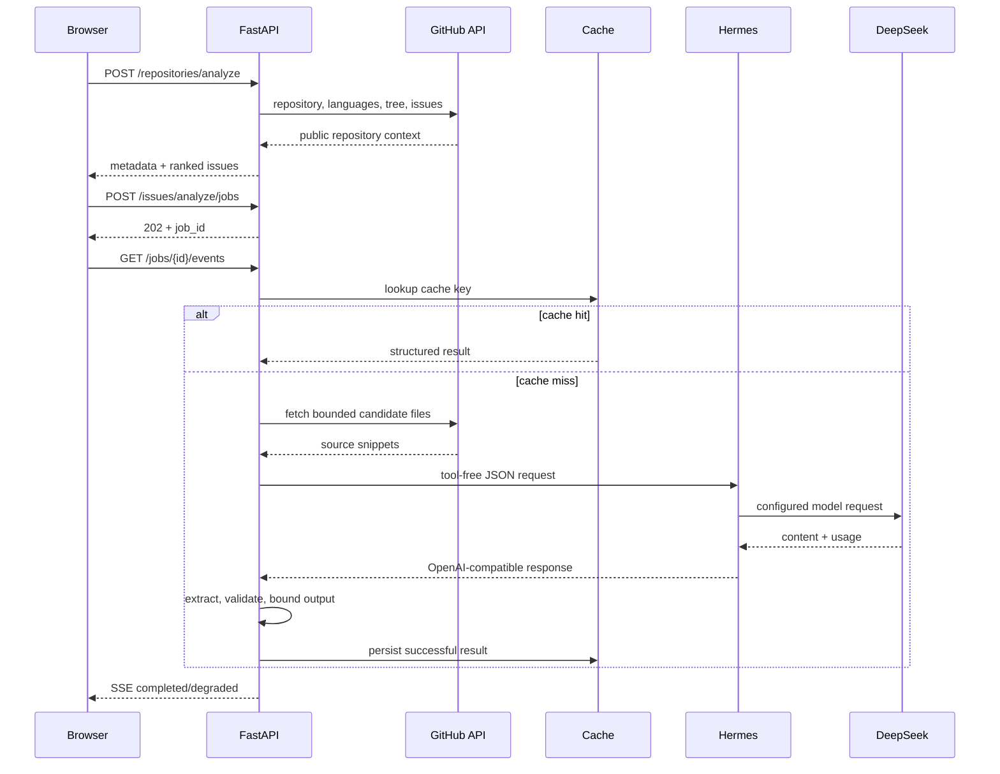

# RepoLens 架构说明

## 系统边界

RepoLens 是一个本地单用户实验系统，不是多租户 SaaS。它只读取公开 GitHub 仓库，不直接修改代码，不写回 Issue，也不保存用户账号。

主要组件：

- `frontend/index.html`：仓库输入、结果展示、按需分析和 SSE 进度。
- `backend/app/main.py`：FastAPI 路由、后台任务和任务状态。
- `backend/app/github.py`：GitHub API、Issue 排名和候选文件选择。
- `backend/app/evidence.py`：候选文件读取、路径校验和带行号证据提取。
- `backend/app/hermes.py`：受控 Hermes 请求、JSON 提取、结构约束和成本计算。
- `backend/app/storage.py`：SQLite 持久缓存和 LRU 淘汰。
- `evaluation/cases.json`：固定候选文件回归案例。

## 请求数据流



## 分层职责

### 确定性层

由普通程序控制：URL 与仓库名校验、GitHub API 请求、Issue 排名、候选路径选择、文件大小与路径安全、证据行号、缓存键、JSON 结构与长度、Token 费用计算。

### 概率层

模型只负责根据 Issue 与候选证据解释问题，给出有限实施步骤、测试方案和风险，并声明使用了哪些证据 ID。模型不能通过 RepoLens 请求访问网络、终端或浏览器，也不能自行修改文件。

## 缓存设计

缓存键：

```text
(repository, issue_number, issue_updated_at, prompt_version)
```

Issue 更新后不能复用旧分析，Prompt 结构改变后也不能复用不兼容结果。缓存分为内存热层和 SQLite 持久层，最多保留 256 条并按最近使用时间淘汰。暂时故障产生的降级结果不缓存。

## 异步任务状态

```text
queued
  -> checking_cache
      -> cache_hit
      -> fetching_evidence
          -> calling_hermes
              -> completed
              -> degraded
              -> failed
```

活动任务保存在进程内。后端重启会丢失活动任务状态，但已写入 SQLite 的成功分析仍可读取。

## 信任边界

### GitHub 内容

仓库名、Issue、文件路径和源码均视为不可信输入。代码证据获取会校验 `owner/repository` 格式，拒绝绝对路径和 `..` 路径穿越，并限制单个源码文件大小、证据文件数和总字符数。

### 模型内容

Hermes/DeepSeek 输出视为不可信输入。后端会从 Markdown 或额外文本中安全提取 JSON，校验必需字段与数组类型，限制解释和列表长度，只保留真实提供过的证据 ID，无法恢复时返回安全降级结果。

### 密钥

密钥只通过进程环境或现有 Hermes 配置传递。`.webui_secret_key`、`.env`、密钥文件、数据库和运行日志均被 Git 忽略。

## 失败矩阵

| 失败场景 | 系统行为 | 是否缓存 |
| --- | --- | ---: |
| GitHub URL 非法 | 返回 4xx 验证错误 | 否 |
| 仓库不存在或无权读取 | 返回明确 GitHub 错误 | 否 |
| 候选路径穿越 | 拒绝读取 | 否 |
| 文件过大或不可解码 | 跳过该证据 | 否 |
| Hermes 未配置密钥 | 返回规则降级结果 | 否 |
| Hermes 连接失败/超时 | 记录失败类型并降级 | 否 |
| Hermes 401/429/5xx | 记录状态类别并降级 | 否 |
| 模型返回无效 JSON | 尝试提取，失败后降级 | 否 |
| 模型引用不存在证据 | 删除无效引用 | 成功结构可缓存 |
| 相同请求并发到达 | 共享进行中的任务 | 成功后缓存一次 |
| 服务在任务中重启 | 活动任务丢失，可重新请求 | 已完成缓存保留 |
| SSE 客户端断开 | 后台任务继续，可轮询状态 | 成功后缓存 |

## 成本边界

- Issue 正文最多发送 3,500 字符；
- 最多 3 个候选文件；
- 证据总长度最多 4,500 字符；
- Hermes 工具调用关闭；
- 推理强度设为低；
- 请求 `max_tokens=700`；
- 默认只自动分析 Top-1 Issue；
- 其余 Issue 按需；
- 重复请求使用缓存或 single-flight。

费用遥测是估算值。Provider 返回的 Token usage 和实际账单具有最终权威性。

## 为什么没有注册系统

注册、登录和多租户权限不会提高当前核心实验的有效性，反而引入密码、Session、OAuth、权限隔离和数据删除等新的安全面。当前 README 明确限定为本地单用户系统，避免把未实现的能力包装成企业级功能。

## 为什么不继续做自主修改

自主代码修改会让 RepoLens 与 Hermes、Claude Code、Codex、OpenHands 等 Coding Agent 直接竞争。当前实验没有证明额外页面能够提供更短路径，因此 v0.5 之后不再扩大执行权限，而把学习方向转向独立的 Agent Runtime 实现。
